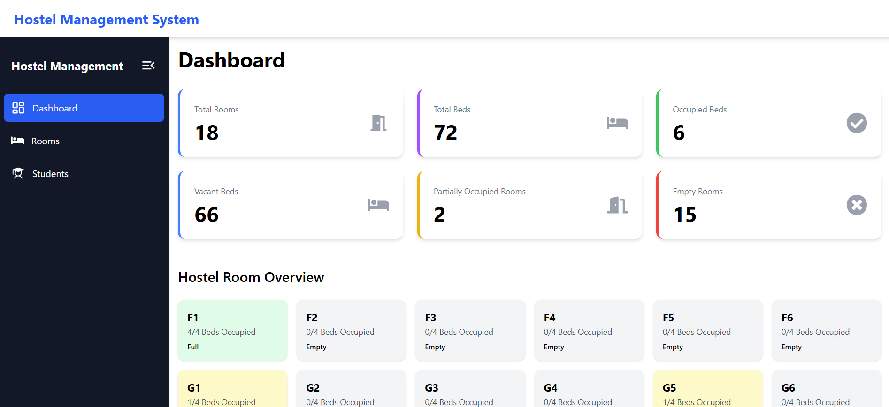
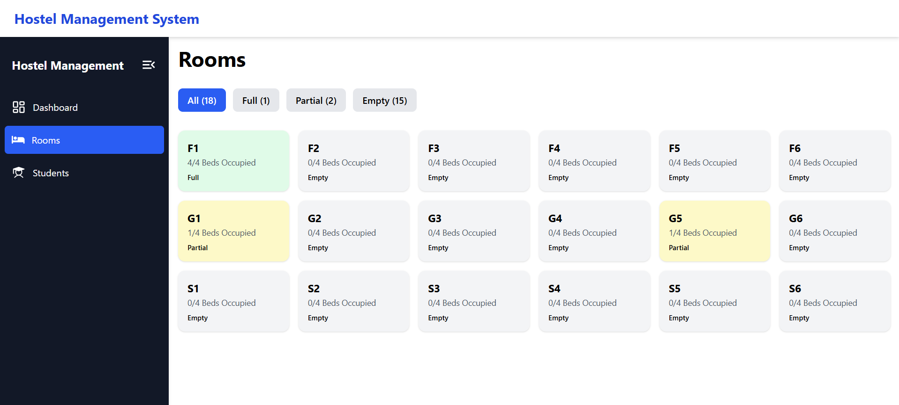
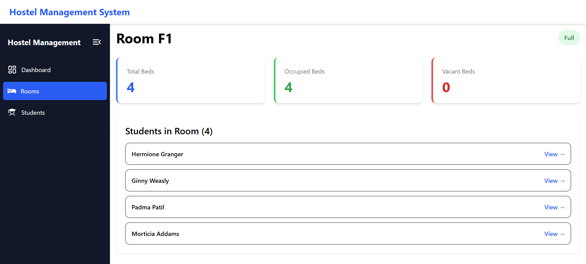
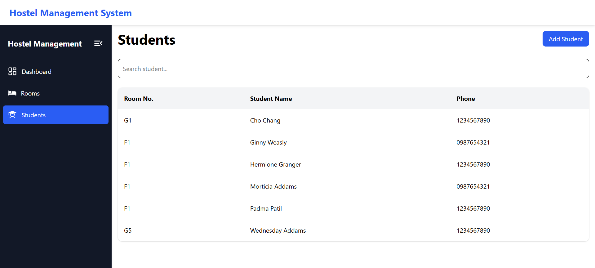
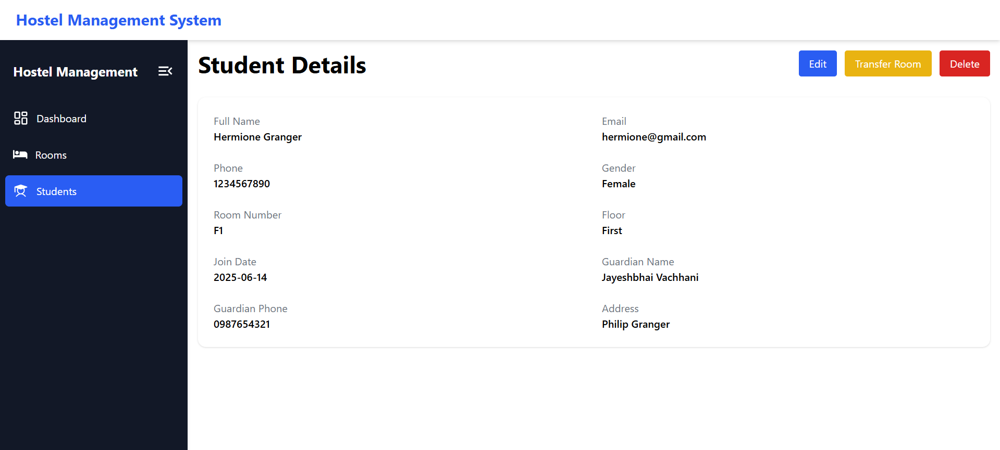

# 🏨 Hostel Management System

A full-stack Hostel Management System built using **React.js**, **Node.js**, **Express.js**, and **PostgreSQL**. This project helps hostel administrators efficiently manage rooms, student allocations, room occupancy, and student records through a centralized dashboard.

---

## 🚀 Features

### 📊 Dashboard

- View total rooms
- View total beds
- View occupied beds
- View vacant beds
- View fully occupied rooms
- View partially occupied rooms
- View empty rooms
- Visual room occupancy overview

### 🚪 Room Management

- View all hostel rooms
- Track occupancy of each room
- View room details
- Check occupied and vacant beds
- View students assigned to a room

### 👨‍🎓 Student Management

- Add new students
- View all students
- Search students by name
- View student details
- Edit student information
- Delete student records
- Transfer students between rooms

### 🛏️ Room Allocation Validation

- Prevents assigning students to full rooms
- Prevents room capacity overflow
- Ensures room allocation integrity
- Uses PostgreSQL foreign key relationships

---

## 🏗️ Tech Stack

### Frontend

- React.js
- React Router
- Axios
- Tailwind CSS
- React Icons

### Backend

- Node.js
- Express.js

### Database

- PostgreSQL
- pg (Node PostgreSQL Driver)

### Tools

- Vite
- pgAdmin
- Postman
- Nodemon

---

## 📁 Project Structure

### Backend

```text
backend/
│
├── src/
│   ├── config/
│   │   └── db.js
│   │
│   ├── controllers/
│   │   ├── dashboardController.js
│   │   ├── roomController.js
│   │   └── studentController.js
│   │
│   ├── routes/
│   │   ├── dashboardRoutes.js
│   │   ├── roomRoutes.js
│   │   └── studentRoutes.js
│   │
│   ├── utils/
│   │   └── roomValidation.js
│   │
│   ├── app.js
│   └── server.js
│
├── .env
├── package.json
└── package-lock.json
```

### Frontend

```text
frontend/
│
├── src/
│   ├── components/
│   │   ├── Sidebar.jsx
│   │   ├── Navbar.jsx
│   │   ├── DashboardCard.jsx
│   │   ├── RoomCard.jsx
│   │   └── StudentForm.jsx
│   │
│   ├── pages/
│   │   ├── Dashboard.jsx
│   │   ├── Rooms.jsx
│   │   ├── RoomDetails.jsx
│   │   ├── Students.jsx
│   │   ├── StudentDetails.jsx
│   │   ├── AddStudent.jsx
│   │   └── EditStudent.jsx
│   │
│   ├── services/
│   │   └── api.js
│   │
│   ├── layouts/
│   │   └── MainLayout.jsx
│   │
│   ├── App.jsx
│   ├── main.jsx
│   └── index.css
│
└── package.json
```

---

## 🗄️ Database Schema

### Rooms Table

```sql
CREATE TABLE rooms (
    id SERIAL PRIMARY KEY,
    room_number VARCHAR(10) UNIQUE NOT NULL,
    floor_name VARCHAR(50) NOT NULL,
    total_beds INTEGER NOT NULL
);
```

### Students Table

```sql
CREATE TABLE students (
    id SERIAL PRIMARY KEY,
    full_name VARCHAR(100) NOT NULL,
    email VARCHAR(100),
    phone VARCHAR(15),
    address TEXT,
    join_date DATE NOT NULL,
    room_id INTEGER REFERENCES rooms(id),
    gender VARCHAR(10),
    guardian_name VARCHAR(100),
    guardian_phone VARCHAR(15)
);
```

---

## 🔗 API Endpoints

### Dashboard

| Method | Endpoint         |
| ------ | ---------------- |
| GET    | `/api/dashboard` |

### Rooms

| Method | Endpoint         |
| ------ | ---------------- |
| GET    | `/api/rooms`     |
| GET    | `/api/rooms/:id` |

### Students

| Method | Endpoint                     |
| ------ | ---------------------------- |
| GET    | `/api/students`              |
| GET    | `/api/students?search=name`  |
| GET    | `/api/students/:id`          |
| POST   | `/api/students`              |
| PUT    | `/api/students/:id`          |
| PUT    | `/api/students/:id/transfer` |
| DELETE | `/api/students/:id`          |

---

## ⚙️ Installation

### Clone Repository

### Backend Setup

```bash
cd backend
npm install
```

Create a `.env` file:

```env
PORT=5000

DB_USER=postgres
DB_HOST=localhost
DB_NAME=hostel_management
DB_PASSWORD=your_password
DB_PORT=5432
```

Run Backend:

```bash
npm run dev
```

### Frontend Setup

```bash
cd frontend
npm install
npm run dev
```

---

## 📸 Screenshots

### Dashboard




### Rooms Page




### Room Details



### Students Page



### Student Details



---

## 🎯 Key Learnings

Through this project, I learned:

- Full-stack application development
- PostgreSQL database design
- REST API development
- React Router navigation
- CRUD operations
- Backend validation and business logic
- Database relationships and foreign keys
- Client-server communication using Axios
- State management with React Hooks

---

## 🔮 Future Enhancements

- Authentication & Authorization
- Hostel Fee Management
- Attendance Tracking
- Visitor Management
- Complaint Management
- Notifications
- Analytics Dashboard
- Export Data to Excel/PDF

---

## 👩‍💻 Author

**Pandya Krisha Viral**

B.Tech Electronics & Communication Engineering

Passionate about Full-Stack Development, Problem Solving, and Building Real-World Applications.

---

⭐ If you found this project useful, consider giving it a star.
